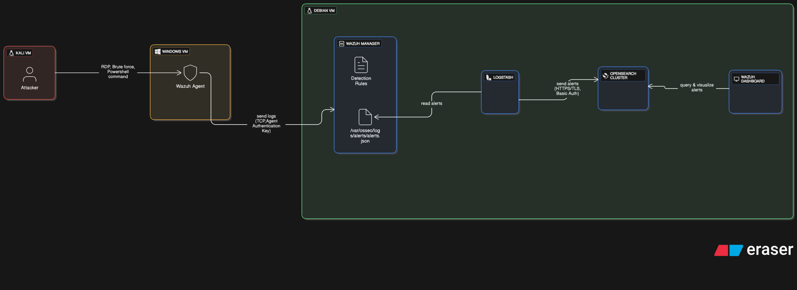
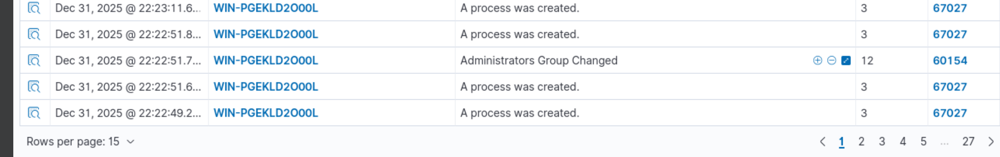

---

# SOC Infrastructure Implementation: Wazuh, Opensearch, and Logstash Pipeline

## Project Overview

This project documents the deployment of a centralized Security Operations Center (SOC) infrastructure. The architecture utilizes a distributed SIEM/XDR model where log collection, processing, and indexing are decoupled to ensure modularity and scalability.

The solution integrates the Wazuh Manager with a Logstash pipeline for data transformation, using OpenSearch as the primary data store.

## System Architecture

The infrastructure is built as a multi-stage data pipeline designed for real-time telemetry analysis.

### Data Flow and Components

1. **Endpoint (Windows VM)**: The Wazuh Agent collects security events and system telemetry.
2. **Wazuh Manager (Debian)**: Receives and analyzes events. It generates alerts based on rule matching and decoders.
3. **Logstash Pipeline**: Acts as the bridge between the Manager and the Indexer. It receives alerts via filebeat or syslog, processes them, and pushes them to the OpenSearch API.
4. **OpenSearch**: Manages data indexing and storage. It receives alert data from Logstash and metadata directly from the management services.
5. **Wazuh Dashboard**: A web interface connected to OpenSearch using dedicated credentials. It allows for visualization of security alerts and agent management.

### Technology Stack

| Component | Technology | Role | Port | Protocol |
| --- | --- | --- | --- | --- |
| **SIEM Engine** | Wazuh Manager | Threat detection and rule engine | 1514/1515 | TCP |
| **Data Transport** | Logstash | ETL: Routing logs to OpenSearch | - | - |
| **Search Engine** | OpenSearch | Data indexing and storage | 9200 | TCP |
| **Visualization** | Wazuh Dashboard | Web UI for analytics | 5601 | HTTP |
| **Server OS** | Debian 12 | Hosting the management stack | - | - |
| **Endpoint OS** | Windows Server 2022 | Monitored target | - | - |

---

## Implementation Details

### Server Configuration (Debian)

The management stack ensures seamless communication between the detection engine and the storage layer.

* **Logstash Integration**: Configured with a dedicated pipeline (`01-wazuh.conf`) to ingest Wazuh alerts and output them to the OpenSearch cluster.
* **Storage Layer**: OpenSearch is configured to index security alerts and maintain agent status information.
* **Dashboard Access**: The dashboard is configured to communicate with the Indexer via internal credentials defined in the configuration files. It is accessible on port **5601** over **HTTP**.

### Network Hardening

The following ports were opened on the Debian host to ensure connectivity:

* **1514/TCP**: Agent communication (Events).
* **1515/TCP**: Agent registration.
* **5601/TCP**: Dashboard web access.
* **9200/TCP**: OpenSearch REST API (Restricted to internal traffic).

### Endpoint Monitoring (Windows)

* **Agent Deployment**: Installed on Windows 10/11, pointing to the Debian Manager's static IP.
* **Monitoring Scope**: Real-time tracking of Windows Event Logs (System, Security, Application) and File Integrity Monitoring (FIM) for critical system directories.

---


# Attack Scenario & Detection Workflow

## Objective

Demonstrates the deployment of a Wazuh SIEM and its ability to detect, correlate, and contextualize a realistic Windows attack scenario, from initial access attempts to post-compromise activities.

---

## Attack Scenario Overview

The attack was simulated from a Kali Linux machine targeting a Windows host monitored by a Wazuh agent.

The following phases were observed and detected.




---

## 1. Initial Access – Authentication Failures

Multiple failed authentication attempts were generated against the Windows machine using invalid credentials.

**Detection:**
- Windows logon failures detected  
- Event ID: 4625  
- Wazuh rule: `60122`

This behavior is commonly associated with password guessing or brute force attempts.

---

## 2. Brute Force Detection (Correlation)

After multiple failed attempts within a short time window, Wazuh successfully triggered a brute force alert.

**Detection:**
- Five authentication failures in five minutes  
- Custom correlation rule: `110001`

This demonstrates the SIEM’s ability to correlate raw events into meaningful security alerts.


---

## 3. Successful RDP Connection (Lateral Movement)

A successful Remote Desktop (RDP) connection was established from the Kali machine using an administrator account.

**Indicators:**
- LogonType: `10` (Remote Interactive)  
- Authentication method: NTLM  
- Privileged account involved  

**Detection:**
- Wazuh rule detecting successful remote logon  
- Alert indicating possible lateral movement or pass-the-hash activity  

The use of NTLM for RDP access on an administrator account represents a high-risk behavior.


---

## 4. Post-Compromise Activity – Privilege Escalation

After gaining access, the attacker added a new user to the local Administrators group using native Windows tools.

**Command observed:**
```powershell
net localgroup Administrateurs test_soc /add
````

**Detection:**

* Windows group modification event
* Wazuh rule detecting administrator group changes

This step illustrates a persistence and privilege escalation technique.



---

## 5. Suspicious Command Execution

Encoded PowerShell commands were executed on the compromised system.

**Indicators:**

* PowerShell launched with the `-enc` parameter
* Encoded payload detected in the command line

**Detection:**

* Custom rule matching encoded PowerShell execution
* Typical post-exploitation behavior


---


## Result and Analysis

The sequence of alerts forms a complete and coherent attack chain:

1. Authentication failures
2. Brute force detection
3. Remote access via RDP
4. Privilege escalation
5. Suspicious command execution

Despite minor timestamp inconsistencies caused by virtualization and log processing delays, the logical order of events remains consistent and exploitable for security analysis.

---

## Conclusion

This project validates the effectiveness of the Wazuh SIEM in detecting and correlating multiple stages of a realistic attack scenario. It highlights the importance of centralized logging, event correlation, and contextual analysis in a Security Operations Center (SOC) environment.

---

## Future Improvements

* Add time-based and source-based correlation rules
* Integrate cloud logs (AWS / Azure)
* Implement automated response actions
* Improve time synchronization (NTP)


## Key SOC Features Demonstrated

* **Automated Log Pipeline**: Implementation of a Manager -> Logstash -> OpenSearch flow for optimized data handling.
* **Vulnerability Management**: Automated detection of known CVEs and outdated software on the Windows endpoint.
* **File Integrity Monitoring**: Tracking unauthorized changes to critical system files and registry keys.
* **Centralized Incident Response**: Capability to query indexed security events and visualize attack patterns through the dashboard.

---

## Repository Structure

```plaintext
.
├── configs/
│   ├── wazuh_manager/      # Wazuh Manager settings (ossec.conf)
│   ├── logstash/           # Logstash pipeline (01-wazuh.conf)
│   ├── opensearch/         # OpenSearch communication settings
│   └── wazuh_dashboard/    # Dashboard connection & credentials config
├── screen/
│   └── report_soc.pdf      # Technical documentation in LaTeX format
├── images/                 # Architecture diagrams and dashboard captures
└── README.md               # Project documentation

```

## Author

**Matteo PADONOU**
Cybersecurity and SOC Engineering Project

---

